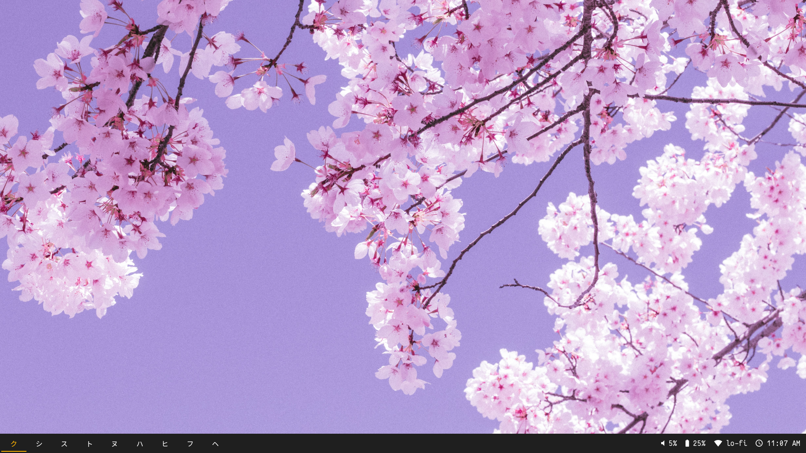
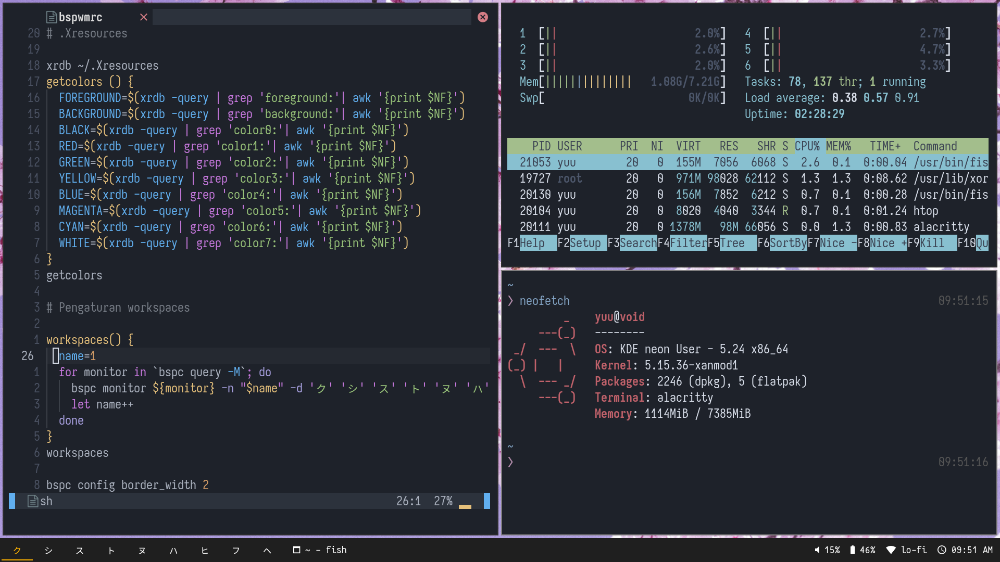

  <h1>Dotfiles</h1>
  
My bspwm configuration
 

 

## Stuff 

- **Distro:** KDE Neon(Ubuntu 20.04 LTS)
- **WM:** bspwm 
- **Shell:** fish 
- **Kernel:** xanmod
- **File Manager:** dolphin
- **Status bar:** polybar
- **Text Editor:** vscode, sometimes neovim
- **Terminal:** alacritty
- **Browser:** brave
- **Font:** Iosevka Mayukai Codepro, Noto Sans CJK JP for Japanese character in polybar
- **Screenshot:** Scrot

## Screenshot 

